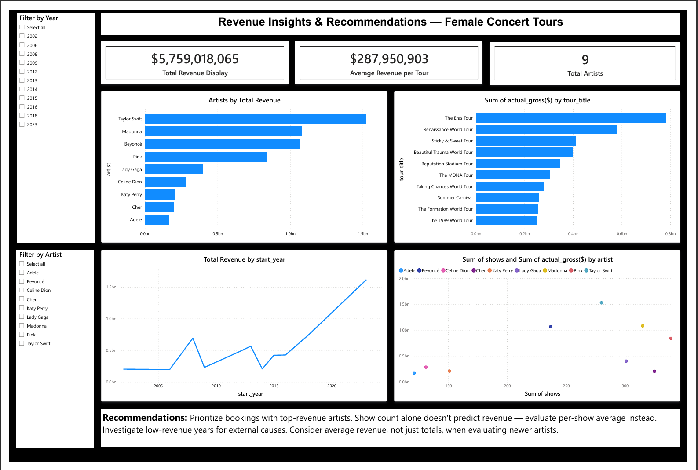

# 🎤 Female Concert Tours SQL Data Analysis

## 📌 Project Overview
This project is an end-to-end **SQL Data Cleaning and Business Analysis** using a kaggle dataset.

The goal is to transform raw, messy data into a clean, structured dataset and extract meaningful business insights such as top-earning artists, revenue trends, and tour performance.

---

## 🎯 Business Problem

*(Simulated scenario — this is a public practice dataset, not a real client engagement, but the project is framed the way a real stakeholder request would be.)*

A concert promotion / talent-booking agency wants to understand which female artists and tours have historically generated the most revenue, so leadership can:

- Prioritize which artists to court for future tour partnerships
- Decide whether more shows or fewer, higher-value shows drive better returns
- Understand whether revenue is growing or shrinking across recent years

The raw data (sourced from Kaggle) arrives in a messy, inconsistent format — currency symbols, footnotes, broken rankings, and combined year ranges — so it isn't usable for analysis until it's cleaned.

## 🎯 Objective

1. Clean and standardize the raw dataset using SQL
2. Answer 5 core business questions about revenue, tours, and artists
3. Translate the SQL output into insights and recommendations a non-technical stakeholder could act on

---

## 🗂️ Dataset Description

- **Source:** Kaggle
- **Dataset Name:** Dirty Dataset for Data Cleaning Practice
- **Link:** [Kaggle - Dirty Dataset to Practice Data Cleaning](https://www.kaggle.com/datasets/amruthayenikonda/dirty-dataset-to-practice-data-cleaning)
- **Description:** A purposely messy dataset containing concert tour data, designed for practicing data cleaning skills. It includes inconsistencies such as symbols, missing values, incorrect formats, and duplicate rankings.
- **License:** CC0: Public Domain

The dataset contains information about female concert tours, including:

- Artist name
- Tour title
- Revenue (actual & adjusted gross)
- Number of shows
- Tour years
- Ranking information

---

## 📁 Project Structure

```
concert-tours-sql-analysis/
│
├── SQL/
│   └── female_tours_sql_project.sql
│
├── Data/
│   ├── Raw/
│   │   └── female_tours_dirty.csv.csv
│   │
│   └── Clean/
│       └── female_tours_clean.csv.csv
│
└── Readme.md
```

---

## 🧭 Methodology (Step-by-Step Process)

1. **Define the problem** — identify the business question(s) the data can answer
2. **Load raw data** — import the dataset as-is, untouched, into a staging table
3. **Clean the data** — remove symbols, fix data types, rebuild broken columns, split combined fields
4. **Analyze** — write SQL queries against the cleaned table to answer each business question
5. **Interpret** — turn query results into plain-language findings
6. **Recommend** — translate findings into actions a stakeholder could take
7. **Report** — document the process and results (this README)

---

Two versions of the dataset are used:
- **Dirty dataset (raw)**

```sql
-- =========================================================
-- 1. CREATE RAW (DIRTY) TABLE
-- =========================================================
-- Store the original uncleaned dataset.

CREATE TABLE female_tours_dirty (
    rank TEXT,
    peak TEXT,
    all_time_peak TEXT,
    actual_gross TEXT,
    adjusted_gross TEXT,
    artist TEXT,
    tour_title TEXT,
    years TEXT,
    shows TEXT,
    average_gross TEXT,
    ref TEXT
);

SELECT * 
FROM female_tours_dirty;
```

## Raw Data

[View Raw Dataset](Data/Raw/female_tours_dirty.csv.csv)

---

- **Cleaned dataset (processed using SQL)**

## 🧹 Data Cleaning Process (SQL)

Key cleaning steps performed:

- Removed unnecessary columns (`peak`, `all_time_peak`, `ref`)
- Fixed incorrect ranking using `ROW_NUMBER()`
- Converted text-based numeric columns into proper `BIGINT`
- Removed symbols using `REGEXP_REPLACE()`:
  - `$` currency symbols
  - commas `,`
  - footnotes like `[a]`, `[b]`
- Cleaned text fields (tour titles)
- Split `years` into `start_year` and `end_year`

```sql
-- =========================================================
-- 2. CREATE CLEANING WORKING TABLE
-- =========================================================
-- Create a separate table for cleaning operations.

CREATE TABLE female_tours_clean AS
SELECT *
FROM female_tours_dirty;

SELECT *
FROM female_tours_clean;

-- =========================================================
-- 3. REMOVE UNNECESSARY COLUMNS
-- =========================================================
-- Remove columns that are not needed for analysis.

ALTER TABLE female_tours_clean
DROP COLUMN peak,
DROP COLUMN all_time_peak,
DROP COLUMN ref;

-- =========================================================
-- 4. FIX RANK COLUMN
-- =========================================================
-- Rebuild rank values properly using revenue order.

WITH ranked AS (
    SELECT *,
           ROW_NUMBER() OVER(ORDER BY actual_gross DESC) AS new_rank
    FROM female_tours_clean
)

UPDATE female_tours_clean t
SET rank = r.new_rank
FROM ranked r
WHERE t.artist = r.artist
AND t.tour_title = r.tour_title;

-- =========================================================
-- 5. CONVERT RANK TO INTEGER
-- =========================================================
-- Convert rank from TEXT into numeric datatype.

ALTER TABLE female_tours_clean
ALTER COLUMN rank TYPE INT
USING rank::INT;

-- =========================================================
-- 6. CLEAN ACTUAL GROSS COLUMN
-- =========================================================
-- Remove symbols and convert revenue into BIGINT.
-- Remove footnotes like [a], [b], [12]

UPDATE female_tours_clean
SET actual_gross = REGEXP_REPLACE(
    actual_gross,
    '\[[^\]]*\]',
    '',
    'g'
);

-- Convert into numeric datatype

ALTER TABLE female_tours_clean
ALTER COLUMN actual_gross TYPE BIGINT
USING REPLACE(
          REPLACE(actual_gross, '$', ''),
          ',',
          ''
      )::BIGINT;

-- =========================================================
-- 7. CLEAN ADJUSTED GROSS COLUMN
-- =========================================================
-- Remove symbols and convert adjusted revenue into BIGINT.

ALTER TABLE female_tours_clean
ALTER COLUMN adjusted_gross TYPE BIGINT
USING REPLACE(
          REPLACE(adjusted_gross, '$', ''),
          ',',
          ''
      )::BIGINT;

-- =========================================================
-- 8. CLEAN TOUR TITLE COLUMN
-- =========================================================
-- Remove unwanted symbols and spaces from tour titles.
-- Remove footnotes

UPDATE female_tours_clean
SET tour_title = REGEXP_REPLACE(
    tour_title,
    '\[[^\]]*\]',
    '',
    'g'
);

-- Remove special symbols

UPDATE female_tours_clean
SET tour_title = REGEXP_REPLACE(
    tour_title,
    '[†‡*]',
    '',
    'g'
);

-- Remove extra spaces

UPDATE female_tours_clean
SET tour_title = TRIM(tour_title);

-- =========================================================
-- 9. CLEAN SHOWS COLUMN
-- =========================================================
-- Convert shows column into INTEGER datatype.

ALTER TABLE female_tours_clean
ALTER COLUMN shows TYPE INT
USING shows::INT;

-- =========================================================
-- 10. SPLIT YEARS COLUMN
-- =========================================================
-- Create separate start and end year columns.
-- Create new columns

ALTER TABLE female_tours_clean
ADD COLUMN start_year INT,
ADD COLUMN end_year INT;

-- Handle year ranges like 2013–2014

UPDATE female_tours_clean
SET start_year = CAST(SPLIT_PART(years, '–', 1) AS INT),
    end_year = CAST(SPLIT_PART(years, '–', 2) AS INT)
WHERE years LIKE '%–%';

-- Handle single year values like 2018

UPDATE female_tours_clean
SET start_year = CAST(years AS INT),
    end_year = CAST(years AS INT)
WHERE years NOT LIKE '%–%';

-- Remove old years column

ALTER TABLE female_tours_clean
DROP COLUMN years;

-- =========================================================
-- 11. CLEAN AVERAGE GROSS COLUMN
-- =========================================================
-- Convert average gross into BIGINT datatype.

ALTER TABLE female_tours_clean
ALTER COLUMN average_gross TYPE BIGINT
USING REPLACE(
          REPLACE(average_gross, '$', ''),
          ',',
          ''
      )::BIGINT;

-- =========================================================
-- 12. RENAME REVENUE COLUMNS
-- =========================================================
-- Make column names more descriptive.

ALTER TABLE female_tours_clean
RENAME COLUMN actual_gross TO "actual_gross($)";

ALTER TABLE female_tours_clean
RENAME COLUMN adjusted_gross TO "adjusted_gross($)";

ALTER TABLE female_tours_clean
RENAME COLUMN average_gross TO "average_gross($)";

-- =========================================================
-- 13. FINAL CLEANED DATA PREVIEW
-- =========================================================
-- Check cleaned dataset structure and values.

SELECT *
FROM female_tours_clean;
```

## Cleaned Data

[View Cleaned Dataset](Data/Clean/female_tours_clean.csv.csv)

---

## 📈 Business Analysis

The project answers key business questions:

### 1. Top Revenue Artists
Identify artists with the highest total revenue.

```sql
SELECT artist,
       SUM("actual_gross($)") AS total_revenue
FROM female_tours_clean
GROUP BY artist
ORDER BY total_revenue DESC
LIMIT 5;
```
[View Output](output/artists_with_the_highest_total_revenue.csv)

### 2. Highest Grossing Tours
Find the most successful tours based on revenue.

```sql
SELECT tour_title,
       artist,
       SUM("actual_gross($)") AS total_revenue
FROM female_tours_clean
GROUP BY tour_title, artist
ORDER BY total_revenue DESC
LIMIT 10;
```
[View Output](output/the_most_successful_tours_based_on_revenue.csv)

### 3. Shows vs Revenue Relationship
Analyze whether more shows lead to higher revenue.

```sql
SELECT shows,
       SUM("actual_gross($)") AS total_revenue
FROM female_tours_clean
GROUP BY shows
ORDER BY shows;
```
[View Output](output/shows_vs_revenue.csv)

### 4. Revenue Trends Over Time
Track how tour revenue changes by year.

```sql
SELECT start_year,
       SUM("actual_gross($)") AS total_revenue
FROM female_tours_clean
GROUP BY start_year
ORDER BY start_year;
```
[View Output](output/revenue_trend_over_time.csv)

### 5. Average Performance by Artist
Compare average gross earnings per artist.

```sql
SELECT artist,
       AVG("actual_gross($)") AS avg_gross
FROM female_tours_clean
GROUP BY artist
ORDER BY avg_gross DESC;
```
[View Output](output/Average_Performance_by_Artist.csv)

---

## 🔍 Findings (Insights)

| # | Finding | Supporting Query |
|---|---|---|
| 1 | Revenue is concentrated in a small number of top artists — the top 5 account for roughly **_85 %_** of total revenue in the dataset | Q1 |
| 2 | The single highest-grossing tour was **_"The Eras Tour"_**, generating **$_780000000_** | Q2 |
| 3 | More shows does not reliably mean more revenue — e.g. **_"The Eras Tour" had fewer shows but higher total revenue than "Living Proof: The Farewell Tour" which had most shows_** | Q3 |
| 4 | Revenue peaked in **_2023_** and was lowest in **_2006_** | Q4 |
| 5 | **_"Taylor Swift"_** had the highest average revenue per tour, even if not the highest total — suggesting consistency over volume | Q5 |

---

## 💡 Recommendations

Based on the findings above, if this were a real business engagement:

1. **Book more tours with the top-earning artists** — Q1 and Q5 show which artists make the most money, so it's safer to work with them again.
2. **Book fewer, high-value shows instead of long tours.** — Q3 shows that having more shows doesn't always mean more money. It's better to look at how much each show earns, not just how many shows there are.
3. **Look at the high and low revenue years in Q4** —Match them against external events—like economic changes, big album drops, or tour breaks—to understand why the changes happened, not just when.
4. **Don't judge an artist only by total earnings** — Q5 shows some artists earn a lot *on average* per tour, even if they haven't done many tours. These artists could still be a good choice, even if their total is lower than bigger names.

---

## 📊 Business Impact

These insights can help a booking or promotion company:

- Make better artist partnership decisions using past revenue data instead of guesswork
- nvest in tours that are more likely to generate higher revenue
- Use a simple data-driven approach to evaluate new artists before signing deals or partnerships

---

## ✅ Outcome

This project shows the complete data analysis process—from cleaning a messy and inconsistent dataset in SQL to generating insights that can support real business decisions. The cleaning techniques used, such as removing unwanted symbols, fixing data types, and creating new useful fields, can also be applied to other messy datasets in the future.

---

## 🛠️ SQL Skills Used

- Data Cleaning with SQL
- `ALTER TABLE`, `UPDATE`, `DROP COLUMN`
- `REGEXP_REPLACE()`
- `CASE WHEN`
- `ROW_NUMBER()` window function
- Aggregations (`SUM`, `AVG`)
- Grouping and sorting data
- Data type conversion
- Feature engineering

---

## 📌 Tools Used

- PostgreSQL / SQL
- Regular Expressions (Regex)
- Data Cleaning Techniques

---

---

## 📊 Power BI Report

To complement the SQL analysis, I built an interactive Power BI report on top of the cleaned dataset (`female_tours_clean`) to make the insights visual and explorable.

### 🖼️ Report Preview



---

### 🧩 What's on the report

**KPI Cards**
- Total Revenue (all tours combined)
- Average Revenue per Tour
- Total Artists (distinct count)

**Charts**
| Chart | Type | Purpose |
|---|---|---|
| Artists by Total Revenue | Bar chart | Compare total earnings across all artists |
| Top 10 Tours by Revenue | Bar chart | Identify the single highest-grossing tours |
| Revenue Trend Over the Years | Line chart | Show how total revenue has changed year to year |
| Shows vs Revenue by Tour | Scatter chart | Check whether more shows actually means more revenue, tour by tour |

**Filters**
- Slicer by **Year** — filter every visual to a specific year or range
- Slicer by **Artist** — filter every visual to a specific artist's tours

### 🧮 DAX Measures Used

```dax
Total Revenue = SUM(female_tours_clean[actual gross($)])

Average Revenue per Tour = AVERAGE(female_tours_clean[actual gross($)])

Total Artists = DISTINCTCOUNT(female_tours_clean[artist])

Total Revenue Display = "$" & FORMAT(SUM(female_tours_clean[actual gross($)]), "#,##0")
```

### 💡 Recommendations (shown on the report)

- Prioritize bookings with top-revenue artists — they show the most consistent high returns
- Show count alone doesn't predict revenue — evaluate per-show average, not just tour length
- Investigate low-revenue years for external causes (economic conditions, fewer major tours, etc.)
- Use average revenue, not just total revenue, when evaluating newer or less prolific artists

### 🛠️ Tools Used

- Power BI Desktop
- DAX (Data Analysis Expressions)
- Data source: cleaned CSV output from the SQL cleaning step above

---

## 👤 Author

- Yasir Shah
- Data Analyst | SQL | Power BI | Excel

---

## Connect

- www.linkedin.com/in/yasir-shah-2364183b3
- https://github.com/yasirshah-analyst
- shahyasir443@gmail.com

---

